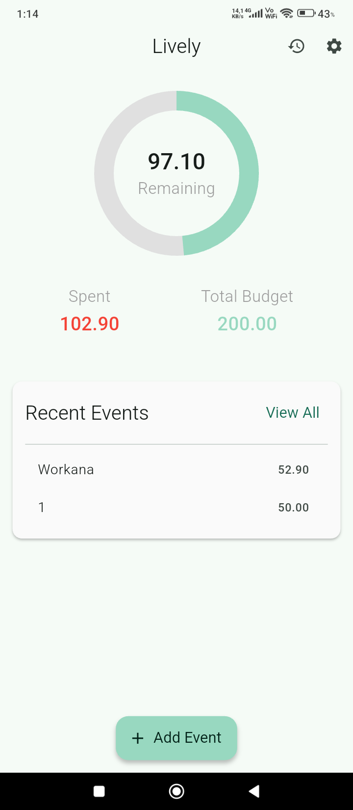
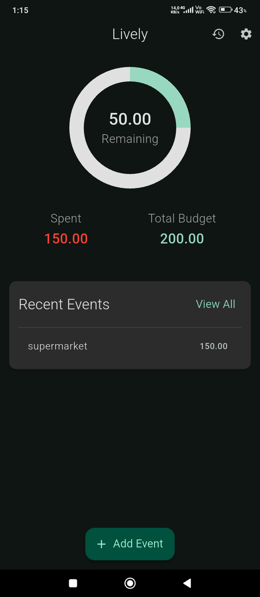
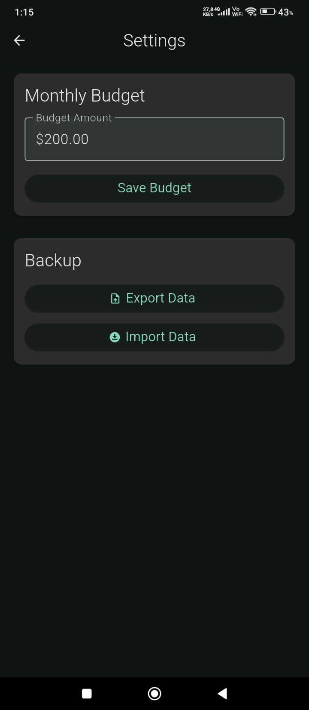

# Lively Budget Manager 📊

[](https://github.com/emanoelsg/Lively/actions/workflows/ci.yml)

---

## 🇧🇷 Sobre o Projeto

O **Lively** é um gerenciador de despesas mensais **simples, bonito e 100% offline**, construído em Flutter.  
Ele ajuda você a controlar seus gastos em relação ao seu orçamento mensal em uma interface limpa e intuitiva.

---

## 🇺🇸 About the Project

**Lively** is a **simple, beautiful, and 100% offline monthly expense manager** built with Flutter.  
It helps you track your spending against a monthly budget in a clean and intuitive interface.

---

## 📸 Screenshots

<p align="center">
  
  
  
  
</p>

---

## ✨ Features | Funcionalidades

- **Offline First / Offline Primeiro:** Todos os dados ficam salvos localmente, sem necessidade de internet.  
- **Budget Tracking / Controle de Orçamento:** Defina um orçamento mensal e veja os gastos em tempo real.  
- **Visualized Spending / Visualização dos Gastos:** Um gráfico em donut mostra o progresso dos seus gastos.  
- **Event History / Histórico de Eventos:** Adicione, edite e exclua despesas com histórico completo.  
- **Backup & Restore / Backup e Restauração:** Exporte e importe seus dados em JSON.  
- **Personalization / Personalização:** Defina foto de perfil e apelido.  
- **Theming / Temas:** Suporte a **Modo Claro e Escuro**.  
- **Multi-language / Multi-idioma:** Totalmente localizado em **Português e Inglês**.  

---

## 🛠️ Tech Stack & Architecture | Stack e Arquitetura

- **Framework:** [Flutter](https://flutter.dev/)  
- **State Management / Gerenciamento de Estado:** [Riverpod](https://riverpod.dev/)  
- **Navigation / Navegação:** [go_router](https://pub.dev/packages/go_router)  
- **Database / Banco de Dados:** [sqflite](https://pub.dev/packages/sqflite)  
- **Charts / Gráficos:** [fl_chart](https://pub.dev/packages/fl_chart)  
- **Image Handling / Imagens:** [image_picker](https://pub.dev/packages/image_picker)  
- **Testing / Testes:** Unitários, Widgets, Integração (Mocktail, sqflite_common_ffi)  
- **CI/CD:** [GitHub Actions](https://github.com/features/actions)  

Arquitetura segue padrão limpo:  
**UI → State (Riverpod Notifiers) → Repository → Data Source (SQLite)**  

---

## 🚀 Getting Started | Início Rápido

### Prerequisites | Pré-requisitos
- Flutter SDK (3.19.0+)  
- IDE como VS Code ou Android Studio  

### Installation | Instalação
```sh
git clone https://github.com/emanoelsg/Lively.git
cd lively
flutter pub get
flutter run
´´´
# Unit & Widget
flutter test

# Integration
flutter test integration_test

# Coverage
flutter test --coverage


🤖 Continuous Integration | Integração Contínua
✅ Formatação

✅ Análise estática

✅ Testes (unit, widget, integration)

✅ Coverage report (Codecov)

✅ Build automático (APK release)

📄 License | Licença
Distribuído sob a licença MIT. Veja o arquivo LICENSE.
Distributed under the MIT License. See LICENSE for details.